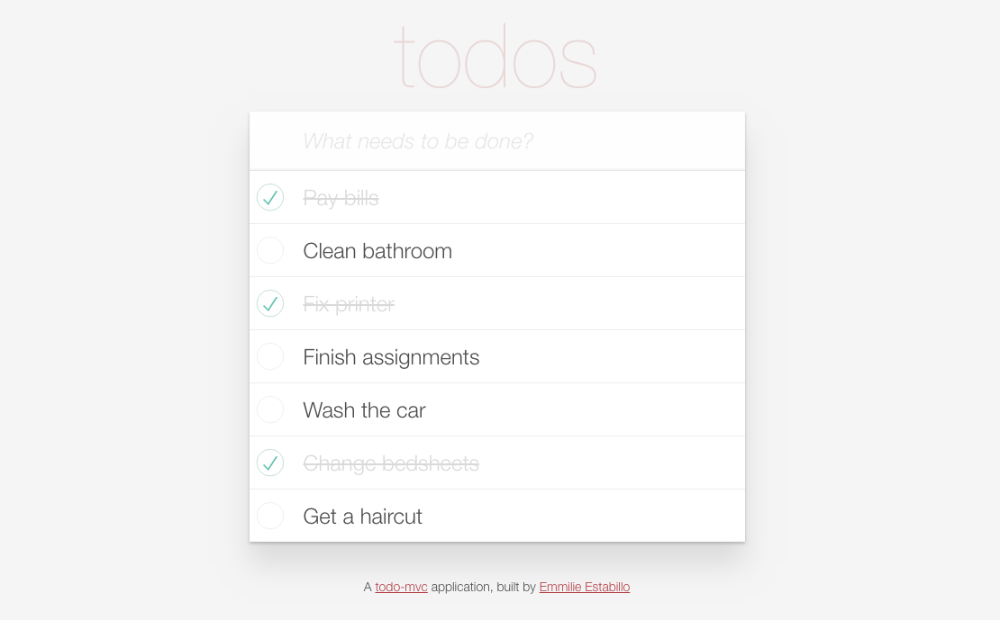

# TODO

 This single-page to-do application features a fluid user interface that – by using JavaScript – allows users to rapidly add dynamic content.

 

---

## Contribute

1. Fork it! ( https://github.com/emestabillo/todo/fork )
2. Create your feature branch: `git checkout -b my-new-feature`
3. Commit your changes: `git commit -am 'Add some feature'`
4. Push to the branch: `git push origin my-new-feature`
5. Submit a pull request

---

## License and Copyright

Copyright (c) 2017 Em Estabillo